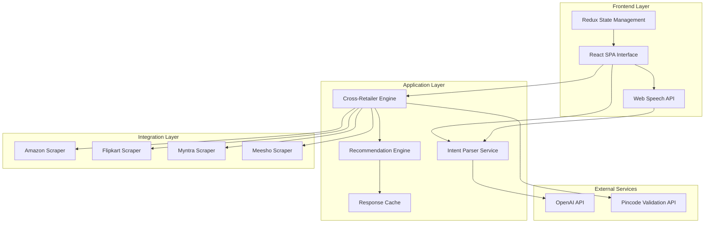

# Design Document: AI Retailer Bot

## Overview

The AI Retailer Bot is a sophisticated single-page application that combines natural language processing, cross-retailer search capabilities, and AI-powered recommendations to create an intelligent shopping assistant. The system processes user queries in natural language, searches multiple e-commerce platforms simultaneously, and provides intelligent recommendations with explanations.

The architecture follows a modular design with clear separation between the user interface, natural language processing, retailer integration, and recommendation systems. This enables independent scaling and maintenance of each component while ensuring fast response times and reliable performance.

## Architecture

### High-Level Architecture



### Technology Stack

**Frontend Framework**: React 18 with TypeScript
- Chosen for its mature ecosystem, excellent performance with virtual DOM, and strong TypeScript support
- Provides component reusability and efficient state management
- Large community support and extensive documentation

**State Management**: Redux Toolkit
- Centralized state management for complex application state
- Predictable state updates and time-travel debugging
- Excellent DevTools integration

**Styling**: Tailwind CSS
- Utility-first approach for rapid UI development
- Consistent design system and responsive design capabilities
- Small bundle size with purging unused styles

**Voice Integration**: Web Speech API
- Native browser support for speech recognition and synthesis
- No external dependencies required
- Real-time speech-to-text conversion

**Backend Services**: Node.js with Express
- JavaScript ecosystem consistency
- Excellent performance for I/O-intensive operations
- Rich package ecosystem for web scraping and API integration

## Components and Interfaces

### Frontend Components

#### SearchInterface Component
```typescript
interface SearchInterfaceProps {
  onSearch: (query: ProductQuery) => void;
  isLoading: boolean;
  voiceEnabled: boolean;
}

interface ProductQuery {
  description: string;
  pincode: string;
  budget?: PriceRange;
  filters?: ProductFilters;
  confidence: number;
}
```

**Responsibilities:**
- Render natural language input field with live preview
- Handle voice input integration
- Display intent parsing results with confidence scores
- Manage advanced filters in collapsible interface
- Validate pincode input format

#### IntentPreview Component
```typescript
interface IntentPreviewProps {
  parsedIntent: ParsedIntent;
  confidence: number;
}

interface ParsedIntent {
  productType: string;
  budget: PriceRange | null;
  features: string[];
  brand?: string;
  specifications?: Record<string, string>;
}
```

**Responsibilities:**
- Display extracted product information in real-time
- Show confidence indicators for parsing accuracy
- Allow users to modify detected intent
- Provide visual feedback for parsing quality

#### CrossRetailerInsights Component
```typescript
interface CrossRetailerInsightsProps {
  insights: RetailerInsights;
  isLoading: boolean;
}

interface RetailerInsights {
  bestPrice: { retailer: string; price: number; product: Product };
  fastestDelivery: { retailer: string; eta: string; product: Product };
  mostOptions: { retailer: string; count: number };
}
```

**Responsibilities:**
- Display comparative insights across retailers
- Highlight best deals and delivery options
- Update insights in real-time as results load
- Provide quick navigation to specific retailer results

#### RetailerResults Component
```typescript
interface RetailerResultsProps {
  retailer: RetailerName;
  products: Product[];
  status: SearchStatus;
  onFeedback: (productId: string, feedback: FeedbackType) => void;
}

interface Product {
  id: string;
  name: string;
  price: number;
  image: string;
  deliveryInfo: DeliveryInfo;
  matchScore: number;
  explanation: string;
  highlights: ProductHighlight[];
  retailerUrl: string;
}
```

**Responsibilities:**
- Display products in card layout with progressive loading
- Show match scores and AI explanations
- Handle user feedback collection
- Manage product highlighting and labels
- Provide direct links to retailer pages

### Backend Services

#### Intent Parser Service
```typescript
interface IntentParserService {
  parseQuery(query: string): Promise<ParsedIntent>;
  extractEntities(text: string): Promise<EntityExtractionResult>;
  calculateConfidence(intent: ParsedIntent): number;
}

interface EntityExtractionResult {
  productType: string;
  budget: PriceRange | null;
  brand: string | null;
  features: string[];
  specifications: Record<string, string>;
}
```

**Implementation Approach:**
- Utilize OpenAI GPT-4 API for natural language understanding
- Implement prompt engineering for consistent entity extraction
- Use structured output formatting for reliable parsing
- Cache common query patterns for improved performance

#### Cross-Retailer Engine
```typescript
interface CrossRetailerEngine {
  searchAllRetailers(query: ProductQuery): Promise<RetailerSearchResults>;
  searchRetailer(retailer: RetailerName, query: ProductQuery): Promise<Product[]>;
  validateDelivery(pincode: string, retailer: RetailerName): Promise<boolean>;
}

interface RetailerSearchResults {
  amazon: SearchResult;
  flipkart: SearchResult;
  myntra: SearchResult;
  meesho: SearchResult;
}

interface SearchResult {
  status: 'loading' | 'success' | 'error' | 'not_deliverable';
  products: Product[];
  error?: string;
}
```

**Implementation Strategy:**
- Parallel execution of retailer searches using Promise.all()
- Individual error handling to prevent cascade failures
- Timeout management for responsive user experience
- Rate limiting and retry logic for API stability

#### Recommendation Engine
```typescript
interface RecommendationEngine {
  calculateMatchScore(product: Product, query: ProductQuery): number;
  generateExplanation(product: Product, query: ProductQuery): string;
  rankProducts(products: Product[], query: ProductQuery): Product[];
  assignHighlights(products: Product[]): Product[];
}

interface ProductHighlight {
  type: 'top_pick' | 'best_value' | 'fastest_delivery';
  reason: string;
}
```

**Scoring Algorithm:**
- Weighted scoring based on price match, feature alignment, and delivery speed
- Machine learning-inspired approach using feature vectors
- User feedback integration for continuous improvement
- Explanation generation using template-based natural language generation

### Retailer Integration Adapters

#### Amazon Scraper Service
```typescript
interface AmazonScraperService {
  searchProducts(query: string, pincode: string): Promise<Product[]>;
  getProductDetails(productId: string): Promise<ProductDetails>;
  checkDelivery(productId: string, pincode: string): Promise<DeliveryInfo>;
}
```

**Implementation Notes:**
- Use Puppeteer for dynamic content scraping
- Implement rotating proxy support for reliability
- Handle anti-bot measures with request delays and headers
- Parse structured data from product pages

#### Flipkart Scraper Service
```typescript
interface FlipkartScraperService {
  searchProducts(query: string, pincode: string): Promise<Product[]>;
  extractProductInfo(html: string): Product[];
  normalizeProductData(rawData: any): Product;
}
```

**Implementation Strategy:**
- HTTP-based scraping with Axios and Cheerio
- CSS selector-based data extraction
- Price and availability parsing from JSON-LD structured data
- Image URL extraction and validation

## Data Models

### Core Data Structures

#### Product Model
```typescript
interface Product {
  id: string;
  retailer: RetailerName;
  name: string;
  brand: string;
  price: number;
  originalPrice?: number;
  currency: string;
  image: string;
  description: string;
  specifications: Record<string, string>;
  availability: boolean;
  deliveryInfo: DeliveryInfo;
  rating: number;
  reviewCount: number;
  matchScore: number;
  explanation: string;
  highlights: ProductHighlight[];
  retailerUrl: string;
  lastUpdated: Date;
}
```

#### User Query Model
```typescript
interface UserQuery {
  id: string;
  originalText: string;
  parsedIntent: ParsedIntent;
  pincode: string;
  filters: ProductFilters;
  timestamp: Date;
  sessionId: string;
}

interface ProductFilters {
  priceRange?: PriceRange;
  brands?: string[];
  size?: string;
  color?: string;
  specifications?: Record<string, string>;
}
```

#### Search Session Model
```typescript
interface SearchSession {
  id: string;
  queries: UserQuery[];
  results: SearchResult[];
  feedback: UserFeedback[];
  startTime: Date;
  lastActivity: Date;
}

interface UserFeedback {
  productId: string;
  type: 'relevant' | 'not_relevant';
  timestamp: Date;
  queryId: string;
}
```

### Database Schema

**Products Collection:**
- Temporary storage for search results
- TTL index for automatic cleanup (1 hour)
- Indexed by retailer and search query hash

**Sessions Collection:**
- User session tracking for feedback correlation
- Indexed by session ID and timestamp
- Used for recommendation algorithm improvement

**Feedback Collection:**
- User feedback storage for machine learning
- Aggregated data for recommendation tuning
- Privacy-compliant anonymous storage

## Error Handling

### Frontend Error Boundaries

#### Search Error Handling
```typescript
interface SearchErrorBoundary {
  handleNetworkError(error: NetworkError): void;
  handleParsingError(error: ParsingError): void;
  handleRetailerError(retailer: string, error: Error): void;
  displayFallbackUI(errorType: ErrorType): ReactElement;
}
```

**Error Recovery Strategies:**
- Graceful degradation when retailers fail
- Retry mechanisms with exponential backoff
- User-friendly error messages with suggested actions
- Fallback to cached results when available

#### Voice Input Error Handling
```typescript
interface VoiceErrorHandler {
  handleMicrophonePermissionDenied(): void;
  handleSpeechRecognitionError(error: SpeechRecognitionError): void;
  handleNoSpeechDetected(): void;
  provideFallbackInput(): void;
}
```

**Voice-Specific Error Management:**
- Clear permission request flows
- Visual feedback for microphone status
- Automatic fallback to text input
- Browser compatibility detection

### Backend Error Resilience

#### Retailer API Error Handling
```typescript
interface RetailerErrorHandler {
  handleRateLimitExceeded(retailer: string): Promise<void>;
  handleConnectionTimeout(retailer: string): Promise<Product[]>;
  handleInvalidResponse(retailer: string, response: any): Product[];
  implementCircuitBreaker(retailer: string): boolean;
}
```

**Resilience Patterns:**
- Circuit breaker pattern for failing retailers
- Exponential backoff for rate-limited requests
- Fallback to cached data when APIs fail
- Health check monitoring for retailer services

#### Data Validation and Sanitization
```typescript
interface DataValidator {
  validateProductData(product: any): ValidationResult;
  sanitizeUserInput(input: string): string;
  validatePincode(pincode: string): boolean;
  normalizePrice(price: string): number;
}
```

**Data Quality Assurance:**
- Input sanitization to prevent injection attacks
- Product data validation before storage
- Price normalization across different formats
- Image URL validation and fallback handling

## Testing Strategy

### Unit Testing Approach

**Component Testing:**
- React Testing Library for component behavior testing
- Jest for test runner and assertion framework
- Mock Service Worker (MSW) for API mocking
- Enzyme for shallow rendering when needed

**Service Testing:**
- Jest for business logic testing
- Supertest for API endpoint testing
- Sinon for function mocking and spying
- Test data factories for consistent test data

**Test Coverage Requirements:**
- Minimum 80% code coverage for critical paths
- 100% coverage for utility functions and data transformations
- Integration test coverage for API endpoints
- End-to-end test coverage for critical user flows

### Property-Based Testing Strategy

**Testing Framework:** fast-check for JavaScript property-based testing
- Minimum 100 iterations per property test
- Custom generators for domain-specific data types
- Shrinking support for minimal failing examples
- Integration with Jest test runner

**Property Test Configuration:**
```typescript
// Example property test configuration
describe('Product Search Properties', () => {
  it('should maintain search result consistency', () => {
    fc.assert(fc.property(
      fc.record({
        query: fc.string(),
        pincode: fc.string(6, 6).filter(s => /^\d{6}$/.test(s)),
        filters: fc.record({
          priceRange: fc.option(fc.record({
            min: fc.nat(),
            max: fc.nat()
          }))
        })
      }),
      async (searchInput) => {
        // Property implementation
      }
    ), { numRuns: 100 });
  });
});
```

**Dual Testing Approach:**
- **Unit tests** focus on specific examples, edge cases, and error conditions
- **Property tests** verify universal properties across all valid inputs
- Both approaches are complementary and necessary for comprehensive coverage
- Unit tests catch concrete bugs, property tests verify general correctness

## Correctness Properties

*A property is a characteristic or behavior that should hold true across all valid executions of a system—essentially, a formal statement about what the system should do. Properties serve as the bridge between human-readable specifications and machine-verifiable correctness guarantees.*

Based on the prework analysis of acceptance criteria, the following properties have been identified as testable through property-based testing. These properties ensure the system behaves correctly across all valid inputs and scenarios.

### Property 1: Intent Parsing and Display Consistency
*For any* natural language product query, the Intent_Parser should extract product type, budget, and features, and the AI_Retailer_Bot should display a live preview containing all extracted information with confidence scores.
**Validates: Requirements 1.1, 1.2**

### Property 2: Incomplete Input Handling
*For any* product query missing essential information (product type or pincode), the AI_Retailer_Bot should request clarification for the missing details.
**Validates: Requirements 1.3**

### Property 3: Ambiguous Term Disambiguation
*For any* product query containing known ambiguous terms, the Intent_Parser should provide disambiguation options to clarify user intent.
**Validates: Requirements 1.4**

### Property 4: Pincode Validation and Filtering
*For any* user input, the AI_Retailer_Bot should require a valid Indian pincode before displaying results, and all returned products should be deliverable to that location.
**Validates: Requirements 2.1, 2.2, 2.3**

### Property 5: Delivery Status Communication
*For any* pincode where delivery is not available, the AI_Retailer_Bot should clearly indicate non-deliverable status, and for deliverable locations, should display location-specific delivery times.
**Validates: Requirements 2.4, 2.5**

### Property 6: Voice Input Round-Trip Consistency
*For any* speech input when voice mode is enabled, converting speech to text and then parsing should produce equivalent results to direct text input parsing.
**Validates: Requirements 3.1, 3.2**

### Property 7: Voice Interface Feedback
*For any* voice operation (listening, processing, or summarizing), the Voice_Interface should provide appropriate visual indicators and spoken summaries containing key comparative insights.
**Validates: Requirements 3.3, 3.4, 3.5**

### Property 8: Filter Application Consistency
*For any* set of applied filters, the Cross_Retailer_Engine should update results across all retailers simultaneously, and filter state should be preserved throughout the user session.
**Validates: Requirements 4.2, 4.4**

### Property 9: Filter Conflict Resolution
*For any* conflict between natural language input and explicit filter selections, the AI_Retailer_Bot should prioritize explicit filter selections over parsed intent.
**Validates: Requirements 4.5**

### Property 10: Empty Results Handling
*For any* filter combination that produces no results, the AI_Retailer_Bot should suggest relaxing specific filter criteria to help users find products.
**Validates: Requirements 4.3**

### Property 11: Parallel Search Execution
*For any* product query, the Cross_Retailer_Engine should search all retailers (Amazon, Flipkart, Myntra, Meesho) in parallel and display real-time status indicators for each retailer.
**Validates: Requirements 5.1, 5.2**

### Property 12: Retailer Failure Isolation
*For any* retailer API failure during search, the AI_Retailer_Bot should continue with available retailers and display appropriate error status without affecting other retailer results.
**Validates: Requirements 5.4**

### Property 13: Cross-Retailer Insights Accuracy
*For any* set of search results across retailers, the Recommendation_Engine should correctly identify and display the retailer with the lowest price, fastest delivery, and most product options.
**Validates: Requirements 6.2, 6.3, 6.4**

### Property 14: Real-Time Insights Updates
*For any* change in underlying search results, the cross-retailer insight panel should update in real-time to reflect the new best price, delivery, and options data.
**Validates: Requirements 6.5**

### Property 15: Match Score Calculation and Display
*For any* product and user query combination, the Recommendation_Engine should calculate a match score based on query, budget, and preferences, and display it as a percentage or rating.
**Validates: Requirements 7.1, 7.2**

### Property 16: Recommendation Explanations
*For any* product recommendation, the Recommendation_Engine should generate an explanation describing why it matches user requirements, following the format "Recommended because [reasons]".
**Validates: Requirements 7.3, 7.5**

### Property 17: Product Highlighting
*For any* set of search results, the AI_Retailer_Bot should assign appropriate highlight labels ("Top Pick", "Best Value", "Fastest Delivery") to relevant products based on their characteristics.
**Validates: Requirements 7.4**

### Property 18: Product Card Completeness
*For any* product displayed, the product card should contain all required elements: image, name, price, delivery info, match score, "Buy" and "View Details" buttons.
**Validates: Requirements 8.1, 8.3**

### Property 19: Progressive Loading Indicators
*For any* product loading operation, the AI_Retailer_Bot should display clear status indicators during the loading process.
**Validates: Requirements 8.2**

### Property 20: Buy Button Navigation
*For any* product "Buy" button click, the AI_Retailer_Bot should redirect to the correct retailer's product page in a new tab.
**Validates: Requirements 8.4**

### Property 21: Feedback System Completeness
*For any* product recommendation, the AI_Retailer_Bot should provide thumbs up/down feedback options, store the feedback data, and provide visual confirmation when feedback is recorded.
**Validates: Requirements 9.1, 9.3, 9.5**

### Property 22: Feedback Learning Integration
*For any* user feedback provided, the Recommendation_Engine should adjust ranking algorithms for future similar queries, and negative feedback should reduce similar recommendations.
**Validates: Requirements 9.2, 9.4**

### Property 23: Error Message Quality
*For any* error that occurs during system operation, the AI_Retailer_Bot should display user-friendly error messages with recovery options.
**Validates: Requirements 10.5**

### Property 24: Data Normalization and Validation
*For any* product data retrieved from retailers, the AI_Retailer_Bot should normalize it into a consistent format and validate it before display, filtering out invalid data.
**Validates: Requirements 11.2, 11.5**

### Property 25: Rate Limiting and Retry Handling
*For any* API rate limit encountered, the AI_Retailer_Bot should implement appropriate retry mechanisms and handle rate limits gracefully without user-visible failures.
**Validates: Requirements 11.3**

### Property 26: Data Freshness Management
*For any* outdated product data detected, the Cross_Retailer_Engine should automatically refresh the information to maintain accuracy.
**Validates: Requirements 11.4**

### Property 27: AI Decision Transparency
*For any* AI-driven decision or recommendation, the AI_Retailer_Bot should provide clear explanations of the decision-making process for evaluator understanding.
**Validates: Requirements 12.4**

## Error Handling

### Frontend Error Management

**Network Error Handling:**
- Implement retry mechanisms with exponential backoff for failed API calls
- Display user-friendly error messages when network connectivity issues occur
- Provide offline mode indicators and cached result fallbacks when possible
- Graceful degradation when some retailers are unavailable

**Input Validation Errors:**
- Real-time validation feedback for pincode format and completeness
- Clear error messages for invalid or incomplete natural language queries
- Guided error recovery with suggestions for fixing input issues
- Prevention of malformed data submission to backend services

**Voice Interface Error Handling:**
- Microphone permission request flow with clear instructions
- Fallback to text input when speech recognition fails
- Visual and audio feedback for speech recognition status
- Browser compatibility detection and graceful degradation

### Backend Error Resilience

**Retailer Integration Failures:**
- Circuit breaker pattern implementation for consistently failing retailers
- Individual retailer timeout handling without affecting other searches
- Fallback to cached product data when real-time data is unavailable
- Rate limiting compliance with automatic retry scheduling

**Data Processing Errors:**
- Input sanitization to prevent injection attacks and malformed queries
- Product data validation with schema enforcement before storage
- Price and delivery information normalization across different retailer formats
- Image URL validation with fallback to placeholder images

**AI Service Integration:**
- OpenAI API error handling with fallback to rule-based parsing
- Explanation generation fallbacks when AI services are unavailable
- Confidence score calculation with default values for parsing failures
- Intent extraction error recovery with user clarification prompts

### Performance and Scalability

**Response Time Management:**
- Parallel retailer search execution to minimize total response time
- Progressive result loading to show partial results as they become available
- Caching strategies for frequently searched products and queries
- Database query optimization for session and feedback data

**Resource Management:**
- Memory usage optimization for large product result sets
- Connection pooling for retailer API integrations
- Garbage collection optimization for long-running search sessions
- CPU usage monitoring for AI processing operations

## Testing Strategy

### Comprehensive Testing Approach

The AI Retailer Bot requires a dual testing strategy combining traditional unit testing with property-based testing to ensure both specific functionality and universal correctness properties.

**Unit Testing Focus Areas:**
- **Specific Examples**: Test concrete scenarios like the example query "Running shoes under ₹3000 for daily jogging"
- **Edge Cases**: Test boundary conditions such as maximum price ranges, empty search results, and invalid pincodes
- **Error Conditions**: Test specific error scenarios like network failures, invalid API responses, and malformed user input
- **Integration Points**: Test component interactions, API integrations, and data flow between services
- **UI Component Behavior**: Test React component rendering, user interactions, and state management

**Property-Based Testing Focus Areas:**
- **Universal Properties**: Test properties that should hold for all valid inputs across the entire input space
- **Data Consistency**: Verify that data transformations maintain consistency across different retailers and formats
- **Business Logic Correctness**: Test that recommendation algorithms and scoring functions behave correctly for all input combinations
- **System Invariants**: Verify that system state remains consistent regardless of user interaction patterns

### Property-Based Testing Configuration

**Framework Selection**: fast-check for JavaScript/TypeScript property-based testing
- Integrates seamlessly with Jest test runner
- Provides excellent shrinking capabilities for minimal failing examples
- Supports custom generators for domain-specific data types
- Offers configurable test execution parameters

**Test Execution Parameters:**
- **Minimum 100 iterations** per property test to ensure comprehensive input coverage
- **Custom generators** for product queries, pincodes, and retailer data
- **Shrinking enabled** to find minimal failing examples for debugging
- **Timeout configuration** appropriate for AI service integration tests

**Property Test Tagging Format:**
Each property-based test must include a comment tag referencing the design document property:
```typescript
// Feature: ai-retailer-bot, Property 1: Intent Parsing and Display Consistency
```

### Test Coverage Requirements

**Code Coverage Targets:**
- **90% coverage** for critical business logic components (intent parsing, recommendation engine, cross-retailer search)
- **80% coverage** for UI components and user interaction handlers
- **100% coverage** for utility functions, data transformations, and validation logic
- **Integration test coverage** for all external API interactions and data flows

**Property Coverage:**
- **All 27 correctness properties** must have corresponding property-based tests
- **Each acceptance criterion** marked as testable in prework analysis must be covered
- **Round-trip properties** for all data serialization and parsing operations
- **Invariant properties** for all data transformations and state changes

### Testing Infrastructure

**Test Environment Setup:**
- **Mock Service Worker (MSW)** for API mocking and network request interception
- **React Testing Library** for component testing with user-centric approach
- **Supertest** for API endpoint testing and integration verification
- **Test containers** for database integration testing with real data stores

**Continuous Integration:**
- **Automated test execution** on all pull requests and main branch commits
- **Property test execution** with extended iteration counts in CI environment
- **Performance regression testing** for search response times and UI rendering
- **Cross-browser testing** for voice interface compatibility and responsive design

**Test Data Management:**
- **Factory functions** for generating consistent test data across unit and property tests
- **Realistic product data** samples from actual retailer responses for integration testing
- **Anonymized user query patterns** for testing natural language processing accuracy
- **Edge case data sets** for testing boundary conditions and error scenarios

### Quality Assurance Process

**Pre-deployment Testing:**
- **Full property test suite execution** with maximum iteration counts
- **End-to-end testing** of critical user journeys across different browsers
- **Performance testing** under simulated load conditions
- **Accessibility testing** for screen reader compatibility and keyboard navigation

**Monitoring and Feedback:**
- **Real-time error tracking** for production issues and user-reported problems
- **Performance monitoring** for search response times and user experience metrics
- **A/B testing framework** for recommendation algorithm improvements
- **User feedback integration** into test case generation for continuous improvement